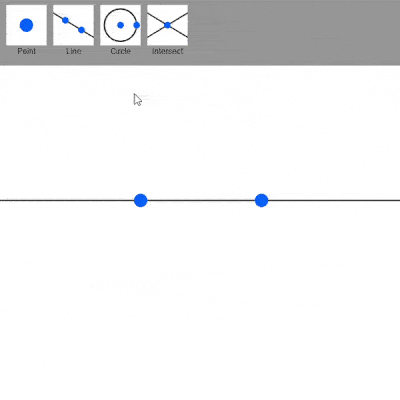

# euclid
 Interactive straightedge and compass construction.

 The tools at the top are
 - **Point**: Create a point at the mouse or locked along a line/circle
 - **Line**: Create the line that passes through two points
 - **Circle**: Create the circle, centered at a point, whose perimeter passes through another point
 - **Intersection**: Create the point(s) of intersection between a line/circle and a line/circle
 
 Right click and drag (or left click and drag in empty space) to pan the camera. Use the mouse wheel to zoom.

 The blue points are freely moveable. The red points are locked along a line/circle, so their motion has one degree of freedom. The green points are intersection points and cannot be moved directly.

 Shift-click to select multiple points/lines/circles. Holding shift and dragging one point will move all selected points simultaneously. Pressing "DELETE" will remove all selected constructions and any other construction that depends on any selected construction.

 When points of intersection are made between two non-intersecting lines/circles, the points and any other construction that depends on the points are colored transparent red, and their positions are random.

## [Demo](https://raw.githack.com/JentGent/euclid/main/index.html)

